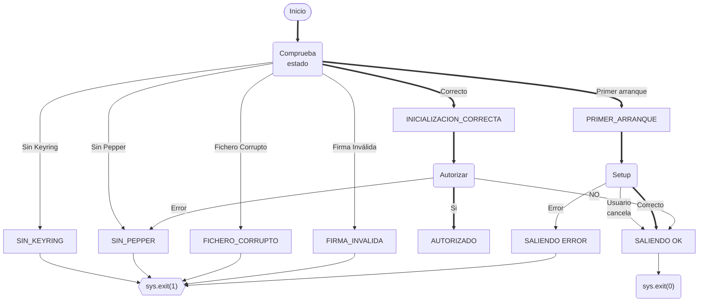

```mermaid
flowchart TD
%% Estados    
    E0([Inicio])
    E1[SIN_KEYRING]
    E2[PRIMER_ARRANQUE]
    E3[SIN_PEPPER]
    E4[FICHERO_CORRUPTO]
    E5[FIRMA_INVALIDA]
    E6[INICIALIZACION_CORRECTA]
    E7[AUTORIZADO]
    E8[SALIENDO OK]
    E9[SALIENDO ERROR]
%% Acciones    
    A1(Comprueba\nestado)
    A2(Setup)
    A3(Autorizar)
%% Finales    
    Z0("sys.exit(0)")
    Z1{{"sys.exit(1)"}}
%% Flujo de estados
    E0 ==> A1
    E2 ==> A2
    E6 ==> A3
    E8 --> Z0
    E1 & E3 & E4 & E5 & E9 --> Z1
%% Resultados de acciones
%% A1: Comprobar estado
    A1 -->|Sin Keyring| E1
    A1 ==>|Primer arranque| E2
    A1 -->|Sin Pepper| E3
    A1 -->|Fichero Corrupto| E4
    A1 -->|Firma Inválida| E5
    A1 ==>|Correcto| E6
%% A2: Setup
    A2 -->|Error| E9
    A2 -->|Usuario\ncancela| E8
    A2 ==>|Correcto| E8
%% A3 Autorizar    
    A3 ==>|Si| E7
    A3 -->|NO| E8
    A3 -->|Error| E3

```

