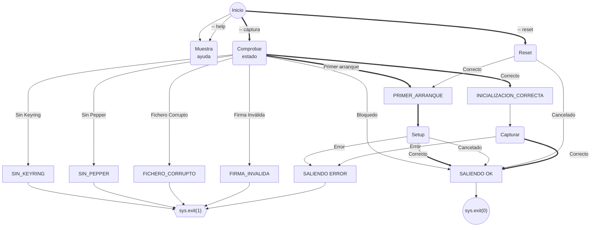

```mermaid
flowchart TD
%% Estados    
    E0((Inicio))
    E1[SIN_KEYRING]
    E2[PRIMER_ARRANQUE]
    E3[SIN_PEPPER]
    E4[FICHERO_CORRUPTO]
    E5[FIRMA_INVALIDA]
    E6[INICIALIZACION_CORRECTA]
    E8[SALIENDO OK]
    E9[SALIENDO ERROR]
%% Acciones
    A0(Muestra\nayuda)
    A1(Comprobar\nestado)
    A2(Setup)
    A3(Reset)
    A5(Capturar)
%% Finales    
    Z0(("sys.exit(0)"))
    Z1{{"sys.exit(1)"}}
%% Flujo de estados
    E0 --> A0
    E0 -->|" -- help "| A0
    E0 ==>|" -- captura "| A1
    E0 ==>|" -- reset "| A3
    E2 ==> A2
    E6 --> A5
%%  E7 --> ??? 
    E8 --> Z0
    E1 & E3 & E4 & E5 & E9 --> Z1
%% Resultados de acciones
%% A1: Comprobar estado
    A1 -->|Sin Keyring| E1
    A1 ==>|Primer arranque| E2
    A1 -->|Sin Pepper| E3
    A1 -->|Fichero Corrupto| E4
    A1 -->|Firma Inválida| E5
    A1 ==>|Correcto| E6
    A1 -->|Bloquedo| E8
%% A2: Setup
    A2 ==>|Correcto| E8
    A2 -->|Cancelado| E8
    A2 -->|Error| E9
%% A3: Reset
    A3 -->|Correcto| E2
    A3 -->|Cancelado| E8
%% A5: Capturar --captura # Todas las acciones pueden devolver los estados de "A1: Comprobar estado"
    A5 -->|Error| E9
    A5 ==>|Correcto| E8
```

